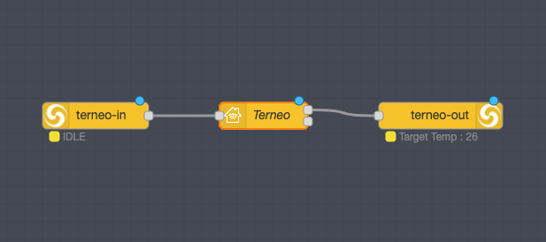

# node-red-contrib-terneo
Node-red nodes for Terneo floor heaters http://terneo.ua/ which work with local API and doesnt require terneo cloud access.

You can control Terneo thermostats from Apple HomeKit. By default its request data from thermostat every 30 sec.
##### Contains 3 nodes:
- terneo-host: config node;
- terneo-in: recieve data from thermostat and prepare data for HomeKit node;
- terneo-out: recieve data and command from HomeKit node and sends it to thermostat;

## Requirements
You need Terneo device with firmware >= 2.3. Also you need to enable local API as described in official terneo documentation:

- ru: https://terneo-api.readthedocs.io/ru/latest/ru/safety_ru.html
- en: https://terneo-api.readthedocs.io/ru/latest/en/safety.html

## Installation
- In Node-Red: Menu - Manage Palette - Install - write "node-red-contrib-terneo"
- In terminal: `npm install node-red-contrib-terneo`

## Configuration
1. Add any terneo node to flow and open properties.
2. In Config choose *Add new terneo-host* and click *Edit*
3. Fill all fields:
- Name of thermostat.
- IP-address: You can find it in your router.
- Serial number: You can find it in TerneoApp.
- Auth token: You can recieve by the folowing command in terminal: 
`curl -i -X POST https://my.hmarex.com/api/login/ -H 'Accept-Language: en' -H 'Content-Type: application/json' --data-raw '{"email": "myterneo@gmail.com", "password": "myterneo2018"}'` Change email and password for yours.
- Save result

## Policy
The author is not responsible for the use and consequences of use of this software.

License
----
GPL-3.0